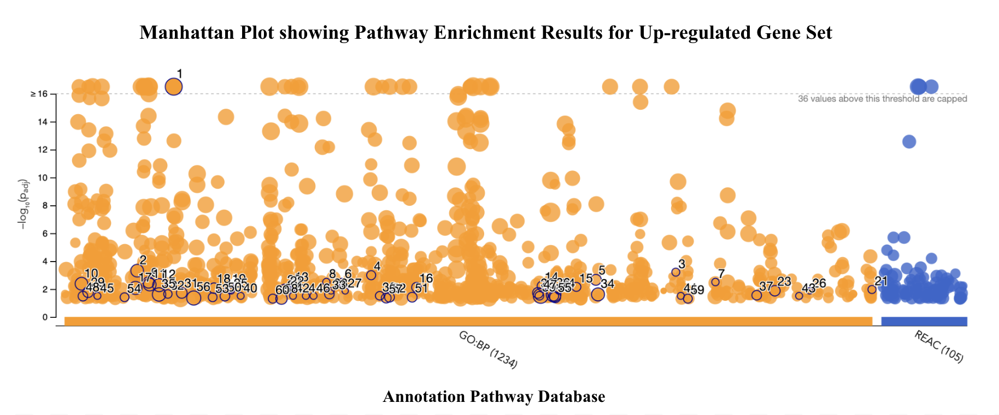
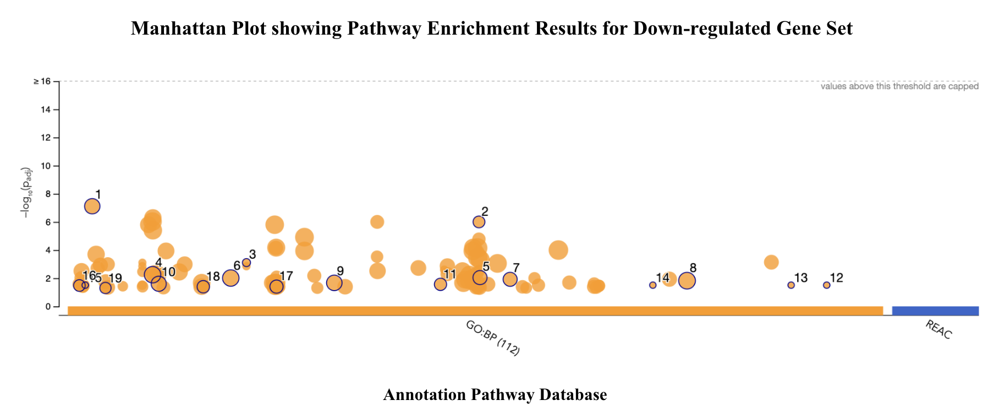
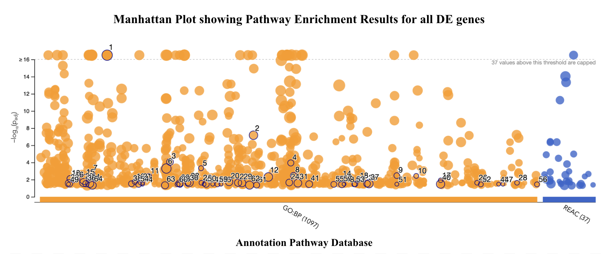
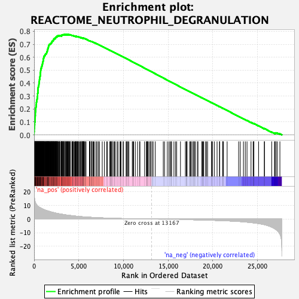
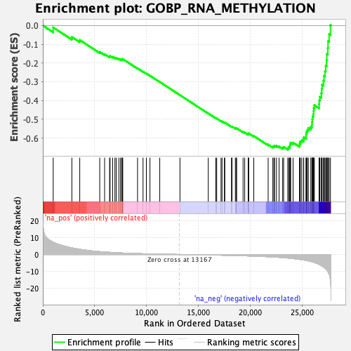
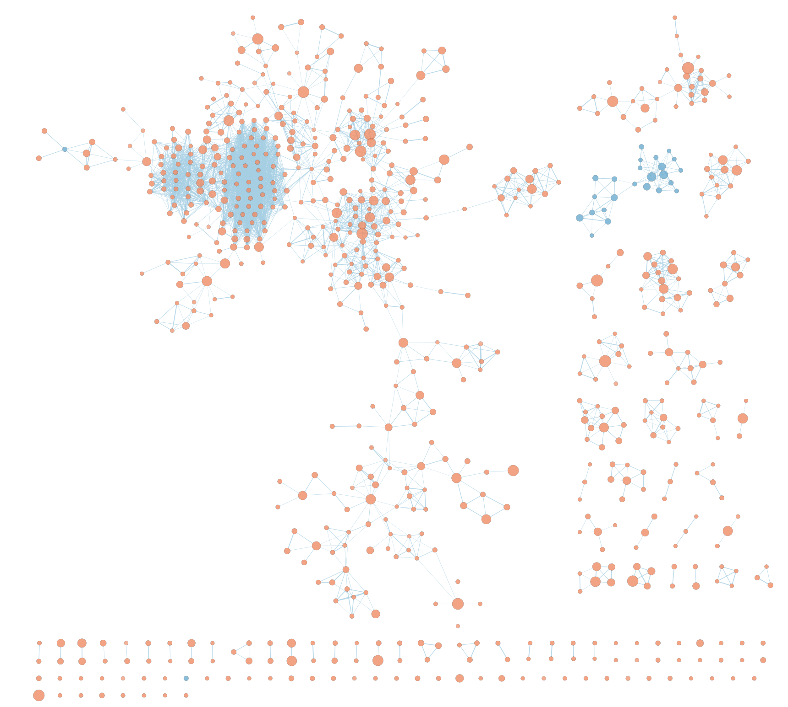
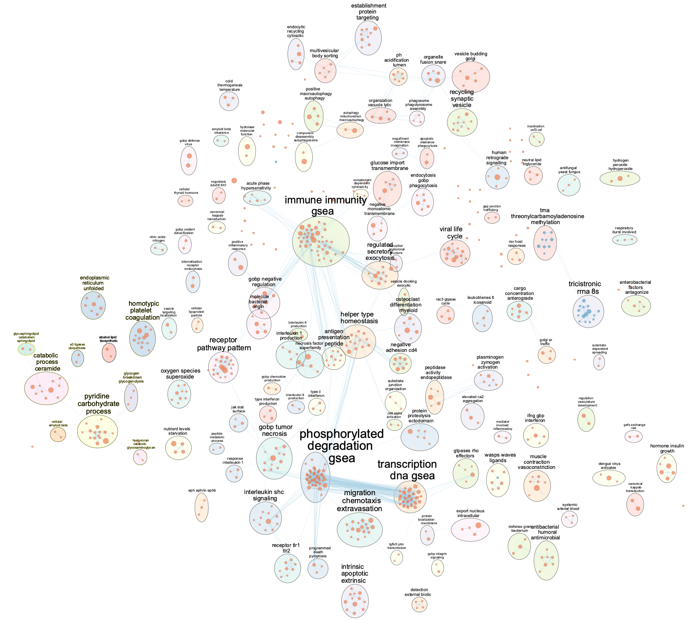
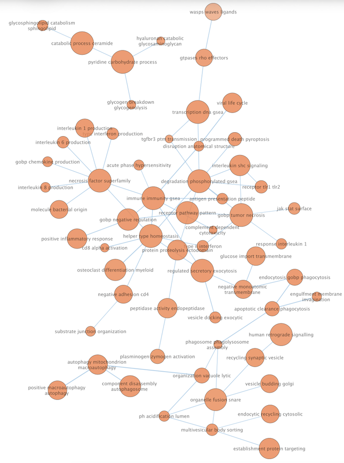
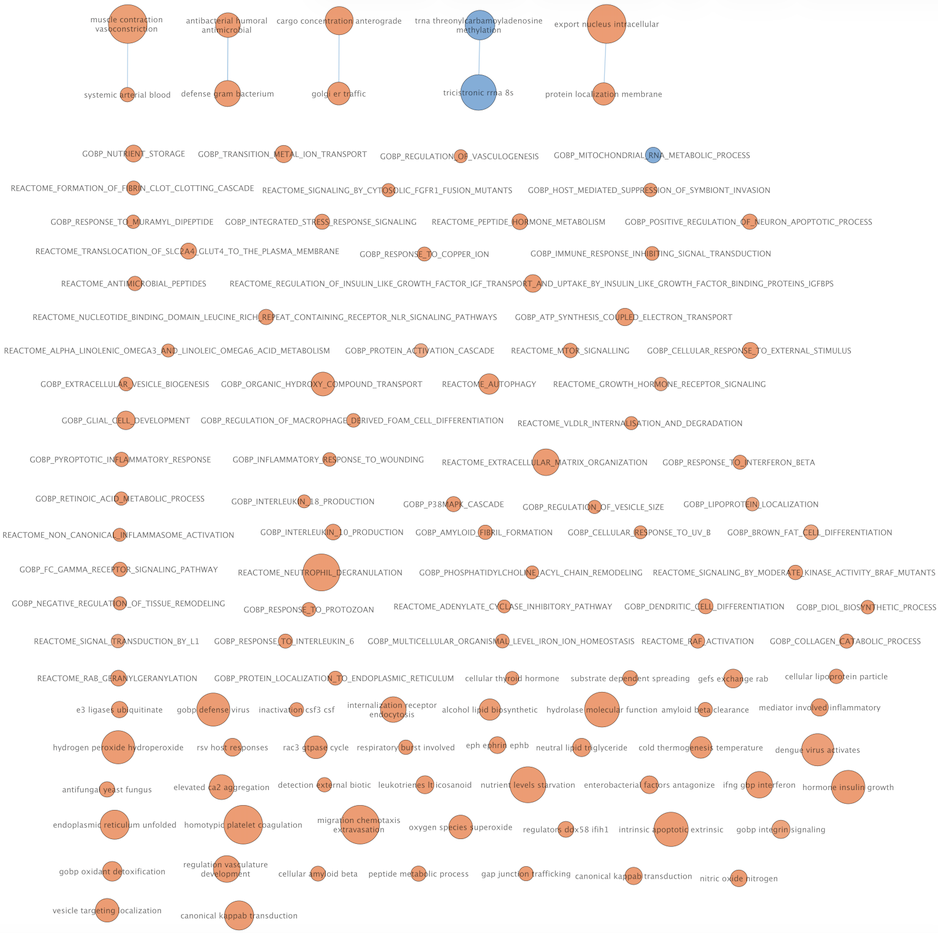

## Table of contents

1.  Introduction

2.  Thresholded over-representation analysis (ORA)

    2.1 Method

    2.2 ORA results

    2.3 Comparison of gene lists

    2.4 Biological interpretation

3.  Non-thresholded gene set enrichment analysis (GSEA)

    3.1 Method

    3.2 GSEA results

    3.3 Comparison with ORA

4.  Cytoscape enrichment map

    4.1 Network creation

    4.2 Network annotation

    4.3 Collapsed theme network

    4.4 Biological interpretation

5.  Conclusion

6.  Questions answered in A2

7.  Link to journal entry

8.  References

## 1. Introduction

This report (Assignment #2, A2) is an extension of Assignment #1, A1, (*Appendix 1*) which focused on data set selection, cleaning, and scoring. Here, we carried out both pathway- and network-level interpretation of the gene expression results from Assignment #1. As a quick recap from A1, the dataset analyzed (GEO accession GSE152218) was a human whole-blood bulk RNA-seq dataset which compared patients with active tuberculosis (ATB) and latent tuberculosis infection (LTBI).

In A1, we downloaded raw count data from GEO [@clough2023], mapped the Ensembl identifiers to to HUGO gene symbols (where possible), resolved duplicate mappings (either one Ensembl ID mapping to multiple HUGO symbols, or vice versa), and removed low-count genes (count \< 10). The final filtered dataset contained 29,078 genes across 48 samples (32 LTBI, control, and 16 ATB, test, patients). Counts were normalized using the built-in median-of-ratios method from the `DESeq` function in the `DESeq2` package [@DESeq2] and the variance stabilizing transformation (VST) was used for visualization/exploratory analysis.

Finally, differential expression (DE) analysis was run using the `DESeq` function (with LTBI used as the reference group) where genes were tested using the Wald test and adjusted for multiple testing using Benjamini-Hochberg false discovery rate (FDR). Genes were classified as differentially expressed (i.e., significantly up- or down-regulated) using thresholds of: FDR \< 0.05 and \|log2 fold-change\| \>1. These gene lists (significantly up- and down-regulated genes) were used in thresholded over-representation analysis (ORA) for this assignment. For non-thresholded gene set enrichment analysis (GSEA), ranks were assigned to each gene (see section *3.1 Method*).

Therefore, the aim of this assignment was to move from single-gene results to pathway-level interpretation via thresholded ORA (using significantly differentially expressed genes) and non-thresholded GSEA (using full ranked gene list). The enriched pathways from GSEA was then visualized in Cytoscape [@shannon2003cytoscape] using the "EnrichmentMap Pipeline Collection" [@reimand2019] composed of: 1) EnrichmentMap [@merico2010], 2) AutoAnnotate [@reimand2019], 3) WordCloud [@oesper2011], and 4) clusterMaker2 [@morris2011].

## 2. Thresholded over-representation analysis (ORA)

### 2.1 Method

First, the following packages were installed for all subsequent analyses: `BiocManager` [@BiocManager] and `tibble` [@tibble].

```{r install-packages, message=FALSE, warning=FALSE}
# Install and load dplyr
if (!requireNamespace("BiocManager", quietly = TRUE)) {
  install.packages(BiocManager, dependencies = TRUE)
  library("BiocManager")
} else {
  library("BiocManager")
}

# Install and load tibble
if (!requireNamespace("tibble", quietly = TRUE)) {
  BiocManager::install("tibble")
  library("tibble")
} else {
  library("tibble")
}
```

After loading in all required packages, the genes list from A1 (with their mean values, log2FC, pvalue, adjusted p-value, and significance) was loaded in. Three tables were extracted from this data: 1) list of significantly up-regulated genes (1,466 genes), 2) list of significantly down-regulated genes (1,069 genes), and 3) all significant genes (up- and down-regulated, 2,535 genes). Thresholded over-representation analysis (ORA) was then performed using the g:Profiler web server [@kolberg2023] three times (once for each table).

```{r load-genes, message=FALSE, warning=FALSE}
# Read in RDS file
genes_list_a1 <- readRDS("data/genes_from_a1.rds")

# Filter to all significant DE genes (up- and down-regulated)
all_df <- genes_list_a1[genes_list_a1$significance != "Not Significant", ]

# Filter to up-regulated genes
up_df <- genes_list_a1[genes_list_a1$significance == "Upregulated", ]

# Filter to down-regulated genes
down_df <- genes_list_a1[genes_list_a1$significance == "Downregulated", ]

# Sort by padj values
all_df <- all_df[order(all_df$padj), ]
up_df <- up_df[order(up_df$padj), ]
down_df <- down_df[order(down_df$padj), ]

# Create df for all_genes (with only 2 columns, gene name and padj value)
all_genes <- data.frame(
  gene = rownames(all_df),
  padj = all_df$padj
)

# Create df for up_genes (with only 2 columns, gene name and padj value)
up_genes <- data.frame(
  gene = rownames(up_df),
  padj = up_df$padj
)

# Create df for down_genes (with only 2 columns, gene name and padj value)
down_genes <- data.frame(
  gene = rownames(down_df),
  padj = down_df$padj
)

# Write .txt for up-regulated, down-regulated, and up+down regulated (for input to g:Profiler web server)
write.table(all_genes$gene,
            "data/all_genes.txt",
            quote = FALSE,
            row.names = FALSE,
            col.names = FALSE)
write.table(up_genes$gene,
            "data/up_genes.txt",
            quote = FALSE,
            row.names = FALSE,
            col.names = FALSE)
write.table(down_genes$gene,
            "data/down_genes.txt",
            quote = FALSE,
            row.names = FALSE,
            col.names = FALSE)
```

g:Profiler [@kolberg2023] was used as it is a reliable and well-known framework for functional enrichment analysis and it seamlessly integrates several curated biological databases (e.g., Gene Ontology (GO), Reactome, Wikipathways, etc.) within one platform for easy use. Furthermore, the tool is able to input genes with different representations (useful as A1 kept some Ensembl ID's that weren't able to map in the final gene list) and lets users easily customize statistical parameters like significance threshold type and specified threshold.

ORA analysis lets us understand whether genes from a predefined set (e.g., a particular biological pathway) are represented in a list of differentially expressed genes than we would expect by chance. Statistical significance was determined using a Fisher's exact test (i.e., hypergeometric test), which compares the overlap between the input gene list and the annotated pathway genes relative to the total set of genes in the analysis.

The 2 annotation pathway databases used were: 1) Gene Ontology Biological Processes (<GO:BP>) [@ashburner2000; @thegeneontologyconsortium2026] and 2) Reactome pathways [@milacic2024]. These databases were chosen for the assignment as they provide harmonious functional annotations when interpreting gene expression data. <GO:BP> is able to capture a wide range of biological processes and functional categories, enabling a high-level understanding of our differentially expressed gene set. Moreover, Reactome provides manually curated molecular pathways related to cellular processes and signalling, giving us a low-level understanding of our differentially expressed gene set. Using <GO:BP> and Reactome databases is a powerful combination and will help give us a holistic yet detailed understanding of pathway-level differences between ATB and LTBI patients.

The Gene Ontology and Reactome annotations correspond to the versions implemented in the g:Profiler database release used for the analysis (g:Profiler version e113_eg59_p19_6be52918; updated on 23/05/2025; accessed on 07/03/2026).

When performing the analysis, the g:Profiler web server was used with the following settings: driver terms in GO highlighted, Organism *Homo sapiens* (Human), Benjamini-Hochberg FDR significance threshold, 0.05 user threshold, and "GO biological processes" and "Reactome" data sources selected. As mentioned, the query was ran on 3 different lists of genes: 1) significantly up-regulated genes, 2) significantly down-regulated genes, and 3) all significant genes (i.e, significantly up- and down-regulated genes together).

We filtered to 10 ≤ genes ≤ 500 for the pathways. Previous literature suggests that this is an appropriate range for this search [@hänzelmann2013].

### 2.2 ORA results

*Figure 1* below shows functional enrichment analysis (with <GO:BP> and Reactome as annotation sources) using a Manhattan plot for the up-regulated gene set.



**Figure 1. Manhattan plot showing pathway enrichment results for the significantly up-regulated gene set.** Each dot is a <GO:BP> (orange) or Reactome (blue) pathway. The x-axis (Annotation Pathway Database) groups the pathways by annotation source and the y-axis shows enrichment significance as -log10(adjusted p-value). A higher value on the y-axis signifies a more statistically significant pathway enrichment.

ORA returned 873 significantly enriched <GO:BP> terms (*Table 1* shows the top 10 terms with lowest adjusted p-value from this result) and 92 significantly enriched Reactome pathways (*Table 2* shows the top 10 terms with lowest adjusted p-value from this result) for the up-regulated gene set.

```{r table-one, message=FALSE, warning=FALSE}
# Read in csv
table_1 <- read.csv('g_Profiler_csv/table_1.csv')

# Only take relevant columns
table_1 <- head(table_1[, c("source", "term_name", "term_id", "adjusted_p_value",
                 "term_size", "query_size", "intersection_size",
                 "effective_domain_size", "intersections")], 10)

# Remove rownames
rownames(table_1) <- NULL

# Display
table_1
```

**Table 1. Top 10 enriched <GO:BP> pathway terms identified using thresholded ORA of significantly up-regulated genes.** The pathways are ordered by adjusted_p_value after multiple testing correction by Benjamini-Hochberg FDR (p\<0.05). Each row entry contains the pathway database source, term_name, term_id, adjusted_p_value, term_size, query_size, intersection_size, effective_domain_size, and genes in the intersection.

```{r table-two, message=FALSE, warning=FALSE}
# Read in csv
table_2 <- read.csv('g_Profiler_csv/table_2.csv')

# Only take relevant columns
table_2 <- head(table_2[, c("source", "term_name", "term_id", "adjusted_p_value",
                 "term_size", "query_size", "intersection_size",
                 "effective_domain_size", "intersections")], 10)

# Remove rownames
rownames(table_2) <- NULL

# Display
table_2
```

**Table 2. Top 10 enriched Reactome pathway terms identified using thresholded ORA of significantly up-regulated genes.** The pathways are ordered by adjusted_p_value after multiple testing correction by Benjamini-Hochberg FDR (p\<0.05). Each row entry contains the pathway database source, term_name, term_id, adjusted_p_value, term_size, query_size, intersection_size, effective_domain_size, and genes in the intersection.

*Figure 2* below shows functional enrichment analysis (with <GO:BP> and Reactome as annotation sources) using a Manhattan plot for the down-regulated gene set.



**Figure 2. Manhattan plot showing pathway enrichment results for the significantly down-regulated gene set.** Each dot is a <GO:BP> (orange) or Reactome (blue) pathway. The x-axis (Annotation Pathway Database) groups the pathways by annotation source and the y-axis shows enrichment significance as -log10(adjusted p-value). A higher value on the y-axis signifies a more statistically significant pathway enrichment.

ORA returned 47 significantly enriched <GO:BP> terms (*Table 3* shows the top 10 terms with lowest adjusted p-value from this result) for the down-regulated gene set. The down-regulated gene set contained no significantly enriched Reactome pathways.

```{r table-three, message=FALSE, warning=FALSE}
# Read in csv
table_3 <- read.csv('g_Profiler_csv/table_3.csv')

# Only take relevant columns
table_3 <- head(table_3[, c("source", "term_name", "term_id", "adjusted_p_value",
                 "term_size", "query_size", "intersection_size",
                 "effective_domain_size", "intersections")], 10)

# Remove rownames
rownames(table_3) <- NULL

# Display
table_3
```

**Table 3. Top 10 enriched <GO:BP> pathway terms identified using thresholded ORA of significantly down-regulated genes.** The pathways are ordered by adjusted_p_value after multiple testing correction by Benjamini-Hochberg FDR (p\<0.05). Each row entry contains the pathway database source, term_name, term_id, adjusted_p_value, term_size, query_size, intersection_size, effective_domain_size, and genes in the intersection.

*Figure 3* below shows functional enrichment analysis (with <GO:BP> and Reactome as annotation sources) using a Manhattan plot for all DE genes.



**Figure 3. Manhattan plot showing pathway enrichment results for all significantly differentially expressed genes.** Each dot is a <GO:BP> (orange) or Reactome (blue) pathway. The x-axis (Annotation Pathway Database) groups the pathways by annotation source and the y-axis shows enrichment significance as -log10(adjusted p-value). A higher value on the y-axis signifies a more statistically significant pathway enrichment.

ORA returned 766 significantly enriched <GO:BP> terms (*Table 4* shows the top 10 terms with lowest adjusted p-value from this result) and 29 significantly enriched Reactome pathways (*Table 5* shows the top 10 terms with lowest adjusted p-value from this result) for the combined significant gene list (up- and down-regulated).

```{r table-four, message=FALSE, warning=FALSE}
# Read in csv
table_4 <- read.csv('g_Profiler_csv/table_4.csv')

# Only take relevant columns
table_4 <- head(table_4[, c("source", "term_name", "term_id", "adjusted_p_value",
                 "term_size", "query_size", "intersection_size",
                 "effective_domain_size", "intersections")], 10)

# Remove rownames
rownames(table_4) <- NULL

# Display
table_4
```

**Table 4. Top 10 enriched <GO:BP> pathway terms identified using thresholded ORA of all significant genes (up- and down-regulated).** The pathways are ordered by adjusted_p_value after multiple testing correction by Benjamini-Hochberg FDR (p\<0.05). Each row entry contains the pathway database source, term_name, term_id, adjusted_p_value, term_size, query_size, intersection_size, effective_domain_size, and genes in the intersection.

```{r table-five, message=FALSE, warning=FALSE}
# Read in csv
table_5 <- read.csv('g_Profiler_csv/table_5.csv')

# Only take relevant columns
table_5 <- head(table_5[, c("source", "term_name", "term_id", "adjusted_p_value",
                 "term_size", "query_size", "intersection_size",
                 "effective_domain_size", "intersections")], 10)

# Remove rownames
rownames(table_5) <- NULL

# Display
table_5
```

**Table 5. Top 10 enriched Reactome pathway terms identified using thresholded ORA of all significant genes (up- and down-regulated).** The pathways are ordered by adjusted_p_value after multiple testing correction by Benjamini-Hochberg FDR (p\<0.05). Each row entry contains the pathway database source, term_name, term_id, adjusted_p_value, term_size, query_size, intersection_size, effective_domain_size, and genes in the intersection.

### 2.3 Comparison of gene lists

Examining the up- and down-regulated gene sets independently allowed for clearer biological interpretation when compared to analyzing all DE genes together.

The up-regulated set of genes was dominated by both innate immune and inflammatory processes. The top <GO:BP> terms included defense response to bacterium, response to lipopolysaccharide, regulation of inflammatory response, and myeloid leukocyte activation. Reactome pathways highlighted neutrophil degranulation and other pathways linked to extracellular matrix organization. These results suggest that patients with ATB have increased innate immune activation and inflammatory signalling in comparison to LTBI patients. This observation is consistent with previous studies showing that ATB is associated with strong inflammatory transcriptional responses, particularly involving neutrophil-driven and interferon-inducible immune pathways [@berry2010].

The down-regulated set of genes was enriched for adaptive immune pathways, in particular B-cell receptor signalling, B-cell activation, and antigen receptor-mediated signalling. This is indicative of stronger transcriptional signatures of adaptive immune regulation in LTBI samples. Previous studies have suggested that those with LTBI maintain adaptive immune responses that contribute to containment of the TB infection, but usually without progressing to an active disease [@ogarra2013].

Through the analysis of all DE genes (up- and down-regulated), the enrichment results were more broad and primarily reflected general immune and inflammatory processes. These include chemotaxis, myeloid leukocyte activation, and regulation of inflammatory response. It is true that using all DE genes gives us a holistic overview of the immune activity in TB, but the distinct biology within each condition can become partially obscured. By separating the gene list into up- and down-regulated genes, we are able to clearly understand the underlying biological differences between ATB (e.g., increased innate inflammatory responses) and LTBI (e.g., strong adaptive immune processes) [@sweeney2016].

### 2.4 Biological interpretation

The ORA results found are consistent with the results found in the original papers associated with this dataset (GSE152218): Johnson et al. (2021) and VanValkenburg et al. (2022). In our analysis, genes up-regulated in ATB were primarily enriched for both innate immune response and inflammatory pathways, consistent with Johnson et al.'s team who found that ATB transcriptional signatures are mainly related to pathways like NF-κB signalling and cytokine–cytokine receptor interaction (which are both key regulators of immune and inflammatory processes) [@johnson2021]. Similar to Johnson et al.'s team, VanValkenburg et al. found increased activation of inflammatory pathways (e.g., neutrophil activation and IL-1/IL-6 signalling) in association with ATB progression [@vanvalkenburg2022].

The down-regulated genes in ATB were enriched for adaptive immune pathways (mainly B-cell receptor signalling). While both the original papers mainly emphasized immune and inflammatory pathways linked to active disease, it is plausible to see the adaptive immune system's role in LTBI as it is a controlled infection in which the host immune system can contain the TB infection [@ogarra2013].

In addition to the original papers linked to our dataset of interest, other studies support our findings. Berry et al. showed that ATB is characterized by a strong interferon-inducible inflammatory transcriptional signature in blood (mainly driven by neutrophils, i.e., innate immune cells) [@berry2010]. Moreover, Sweeney et al. identified a three-gene transcriptional signature linking TB infection with immune activation [@sweeney2016].

Together, all these studies support the interpretation that ATB is linked with inflammatory and innate immune transcriptional responses, while LTBI is enriched for adaptive immune response pathways.

## 3. Non-thresholded gene set enrichment analysis (GSEA)

### 3.1 Method

Non-thresholded GSEA was also performed to see whether certain pathways tend to occur towards the top or bottom of the fully ranked gene list (all genes, not just the thresholded subset of significant genes). It is important to also do this analysis as there may be biologically meaningful pathway-level changes that can be detected with genes that do not pass an "arbitrary" DE cutoff.

In order to generate a ranked input list, each gene in the final gene list from A1 was given a ranking score by the following equation:

$$
\text{rank score} = \mathrm{sign}(\log_2FC) \times -\log_{10}(p\text{-value})
$$

This is a very common ranking system used in pre-ranked GSEA as it incorporates both the magnitude and statistical confidence of DE while also accounting for directionality [@xiao2014]. Genes with a large positive score are strongly up-regulated in ATB patients (relative to LTBI) and those with a large negative score are strongly down-regulated in ATB patients. The ranked list of genes was exported as a `.rnk` file for downstream enrichment analysis.

```{r ranked-genes, message=FALSE, warning=FALSE}
# Create tibble for genes
gsea_df <- tibble::rownames_to_column(genes_list_a1, var = "gene")

# Filter (redundant)
gsea_df <- gsea_df[!is.na(gsea_df$gene) & gsea_df$gene != "", ]
gsea_df <- gsea_df[!is.na(gsea_df$log2FoldChange), ]
gsea_df <- gsea_df[!is.na(gsea_df$pvalue) & gsea_df$pvalue > 0, ]

# Add rank column
gsea_df$rank_score <- sign(gsea_df$log2FoldChange) * -log10(gsea_df$pvalue)

# Order by rank (largest to smallest rank)
gsea_df <- gsea_df[order(abs(gsea_df$rank_score), decreasing = TRUE), ]
gsea_df <- gsea_df[!duplicated(gsea_df$gene), ] # Remove duplicates

# Ranks
ranks <- gsea_df$rank_score
names(ranks) <- gsea_df$gene
ranks <- sort(ranks, decreasing = TRUE)


# Write table (input to GSEA software)
write.table(
  data.frame(gene = names(ranks), score = ranks),
  file = "data/ranked_genes.rnk",
  sep = "\t",
  quote = FALSE,
  row.names = FALSE,
  col.names = FALSE
)
```

Then, I created an account on the "GSEA" website and downloaded "GSEA v4.4.0 Mac App" [@subramanian2005; @mootha2003]. From the desktop application, I ran a pre-ranked GSEA analysis by clicking "Tools \> Run GSEAPreranked". The following parameters were set in the GSEA application: reactome (gsea/msigdb/human/gene_sets/c2.cp.reactome.v2026.1.Hs.symbols.gmt) and <GO:BP> (gsea/msigdb/human/gene_sets/c5.go.bp.v2026.1.Hs.symbols.gmt) gene set databases, 1000 permuations, no_collapse/remap to gene symbols, weighted enrichment statistic, and sets between 10 and 500.

I used the GSEA desktop app to run non-thresholded GSEA as it is the original implementation of the GSEA method and is directly integrated with MSigDB gene set collections (which makes it easy to access <GO:BP> and Reactome pathways).

### 3.2 GSEA results

```{r gsea-results, message=FALSE, warning=FALSE}
# Read in csv's
gsea_report_pos <- read.csv('gsea_csv/gsea_report_pos.csv')
gsea_report_neg <- read.csv('gsea_csv/gsea_report_neg.csv')

# Print statements
print(paste0("There are ", sum(gsea_report_pos$FDR.q.val < 0.05), " significantly positively enriched gene sets"))
print(paste0("There are ", sum(gsea_report_neg$FDR.q.val < 0.05), " significantly negatively enriched gene sets"))
```

The non-thresholded GSEA analysis identified 1,380 significantly positively enriched gene sets and 44 significantly negatively enriched gene sets at a FDR threshold of 0.05. Positively enriched pathways are those whose genes are concentrated towards the top of the ranked gene list (and are more highly expressed in ATB), and the opposite for negatively enriched pathways (which are more prevalent in LTBI).

The strongest positively enriched pathways were mainly linked to innate immune activation and inflammatory responses, including Reactome Neutrophil Degranulation, Antigen Processing and Cross Presentation, Defense Response to Bacterium, Phagocytosis, and Positive Regulation of Inflammatory Response. The normalized enrichment scores (NES) for these pathways ranged from about 2.28 to 2.82, a strong enrichment among genes up-regulated in ATB patients.

In contrast, the strongest negatively enriched pathways were mainly linked to RNA processing and ribosome biogenesis, including RNA Methylation, rRNA Processing, Ribosome Biogenesis, Ribosomal Small Subunit Biogenesis, and tRNA Modification. The normalized enrichment scores (NES) for these pathways ranged from approximately -2.01 to -2.17, a strong enrichment among down-regulated genes in ATB.

It is important to note that since GSEA uses the fully ranked gene list instead of a thresholded subset, the results described above likely capture a wider range of transcriptional patterns which may not be detected through DE filtering alone.

*Figure 4* below shows the GSEA enrichment plot for the Reactome pathway “Neutrophil Degranulation.” This pathway (size = 466 genes) showed the strongest positive enrichment with an NES of 2.82 (FDR q-value = 0)



**Figure 4. GSEA enrichment plot for the Reactome pathway "Neutrophil Degranulation".** The top panel shows the running enrichment score (ES) across the ranked gene list. The green curve increases if a pathway gene is encountered and decreases if a non-pathway gene is encountered. The panel in the middle shows black vertical tick marks to indicate the positions of genes that belong to the pathway within the ranked list. The colour gradient underneath the ticks show the direction of gene expression change across the ranked list (where genes positively correlated with ATB are on the left, and those negatively correlated are on the right). The bottom panel shows the distribution of the ranking metric used to order the genes in the analysis.

Figure 5 below shows the GSEA enrichment plot for the <GO:BP> pathway “RNA Methylation.” This pathway (size = 90 genes) showed the strongest positive enrichment with an NES of -2.17 (FDR q-value = 0).



**Figure 5. GSEA enrichment plot for the <GO:BP> pathway "RNA Methylation".** The top panel shows the running enrichment score (ES) across the ranked gene list. The green curve increases if a pathway gene is encountered and decreases if a non-pathway gene is encountered. The panel in the middle shows black vertical tick marks to indicate the positions of genes that belong to the pathway within the ranked list. The colour gradient underneath the ticks show the direction of gene expression change across the ranked list (where genes positively correlated with ATB are on the left, and those negatively correlated are on the right). The bottom panel shows the distribution of the ranking metric used to order the genes in the analysis.

### 3.3 Comparison with ORA

The GSEA results were generally consistent with the thresholded ORA. Both methods found a strong enrichment of immune and inflammatory pathways, specifically those related to neutrophil activation, phagoyctosis, antigen processing, and inflammatory signalling. This supports the result that ATB is linked with an increased activation of the innate immune system.

That being said, GSEA highlighted additional pathways related to RNA processing and ribosome biogenesis like RNA methylation and rRNA processing (results that were not shown when doing ORA). This is likely due to the fact that these pathways have coordinated and moderate expression changes across several genes which may not pass the DE thresholds used in ORA.

The comparison between thresholded ORA and non-thresholded GSEA is not straightforward. ORA lets us test if pre-defined pathways are over-represented among significantly DE genes and GSEA focused on if genes from a pathway are systematically shifted across the gene list (ranked) [@subramanian2005]. Since GSEA examines the entire ranked gene list instead of a thresholded subset, it is likely able to detect pathway-level changes stemming from moderate gene expression shifts which may be missed by ORA [@hänzelmann2013].

All in all, using both a thresholded (ORA) and non-thresholded (GSEA) approach is beneficial and they both give complementary perspectives on pathway-level regulation.

## 4. Cytoscape enrichment map

### 4.1 Network creation

The results from non-thresholded GSEA were imported into Cytoscape [@shannon2003cytoscape] and visualized using the "EnrichmentMap Pipeline Collection" [@reimand2019] composed of: 1) EnrichmentMap [@merico2010], 2) AutoAnnotate [@reimand2019], 3) WordCloud [@oesper2011], and 4) clusterMaker2 [@morris2011]. The EnrichmentMap represents each enriched gene set as a node and draws edges between the nodes (gene sets) which share overlapping genes. This allows for clustering of related pathways into interpretable functional modules.

The results folder from the GSEA run (containing the pre-ranked GSEA output and corresponding <GO:BP> and Reactome gene set definition files) were inputted into EnrichmentMap in Cytoscape. During network generation, the following parameters were used: node cutoff FDR q-value = 0.01 (followed protocol from Reimand et al. (2019)), edge cutoff = 0.5 (manually set value after trial and error), similarity metric = similarity_coefficient (default), analysis type = GSEA/pre-ranked enrichment results, and gene set size filters = 10 to 500 genes (same range that was used in ORA [@hänzelmann2013]. These thresholds were used in order to balance two key features of the network: 1) network interpretability and 2) network density.

*Figure 6* shows the "raw" resulting enrichment map (prior to any manual editing or annotation). This map contains 751 nodes and 3,307 edges.



**Figure 6. Enrichment map generated from the non-thresholded GSEA results before manual layout and annotation.** Each node represents an enriched gene set from <GO:BP> or Reactome, and edges connect gene sets with overlapping member genes. The map was generated in Cytoscape using the EnrichmentMap pipeline with node cutoff of FDR q-value \< 0.01, edge cutoff = 0.5, similarity metric = similarity_coefficient, analysis type = GSEA/pre-ranked enrichment results, and gene set size filters = 10 to 500 genes. Red nodes indicate up-regulated in ATB, and blue are down-regulated in ATB.

### 4.2 Network annotation

In order to improve interpretability of the network, the enrichment map was annotated using the following components from the EnrichmentMap pipeline: AutoAnnotate [@reimand2019], WordCloud [@oesper2011], and clusterMaker2 [@morris2011].

The steps for creating the annotated network were as follows: click "Apps" on Cytoscape \> "AutoAnnotate" \> "Create Annotation Set". "GS_DESCR" was used the label column, clusterMaker2 was used for cluster creation, WordCloud app was used for label creation, 3 max words per label (default), 1 minimum word occurrence (default), and 8 adjacent word bonus (default).

After the annotated network was created, in the "AutoAnnotate" panel, the clusters were neatly laid out by clicking: "Layout Clusters" \> "Layout Clusters to Minimize Overlap".

The annotated network (*Figure 7*) revealed many prominent pathway clusters. The largest cluster was centered on immune and inflammatory processes, including terms linked to immune activation, receptor pattern recognition, antigen presentation, cytokine production, chemotaxis, phagocytosis, and vesicle-mediated immune function. There were some additional clusters linked with transcription/DNA-level processes, phosphorylated protein degradation, and some other specific pathways related to RNA modification and ribosome-associated pathways.



**Figure 7. Annotated enrichment map of the non-thresholded GSEA results.** The network was clustered and labeled using the Cytoscape EnrichmentMap pipeline with AutoAnnotate, WordCloud, and clusterMaker2. "GS_DESCR" was used the label column, clusterMaker2 was used for cluster creation, WordCloud app was used for label creation, 3 max words per label (default), 1 minimum word occurrence (default), and 8 adjacent word bonus (default). Closely related enriched pathways were grouped into functional modules and summarized using representative annotation terms. Red nodes indicate up-regulated in ATB, and blue are down-regulated in ATB.

### 4.3 Collapsed theme network

In order to obtain a high-level summary of the network, the annotated enrichment map was collapsed into a theme network by clicking "Collapse All" in the toolbar under the "AutoAnnotate" panel. The nodes were manually adjusted for better readability.

Each node in the theme network is a single summary node representing clusters. This representation removes redundancy in the network and focuses on key biological themes present in the dataset.

The major theme present in the theme network are related to immune processes including pathogen recognition, phagocytosis, antigen presentation, chemotaxis, and vesicle-mediated secretion. There were some additional clusters related to protein degradation and transcription-related processes.

These themes fit will with the expected biological model as ATB is known to involve strong innate and inflammatory activation which involves phagocytic immune cells and pathogen-response signalling pathways.

There were only a few truly novel pathways such as pyridine carbohydrate process or MTOR signalling. Overall, the network captured biological signals which were encountered in ORA.





**Figure 8. Collapsed theme network derived from the annotated enrichment map.** In this representation, groups of related enriched pathways are compressed into singular nodes. Red nodes indicate up-regulated in ATB, and blue are down-regulated in ATB.

### 4.4 Biological interpretation

Overall, the enrichment results from Cytoscape support the biological trends found by Johnson et al. and VanValkenburg et al. [@johnson2021; @vanvalkenburg2022]. They reported that ATB is characterized by strong innate and inflammatory activation, specifically neutrohpil responses and cytokine signalling. Our networks showed similar enriched pathways related to phagocytosis, antigen presentation, chemotaxis, and inflammatory signalling.

In large, the results are consistent with the thresholded ORA results (which also picked up on immune and inflammatory pathways). However, the non-thresholded GSEA and network analysis additionally showed pathways related to RNA processing or other signalling pathways which were less prevalent in thresholded ORA. One example is the mTOR signalling pathway which was observed in the network. mTOR has been shown to be a regulator of immune metabolism and autophagy during TB infection [@deretic2013].

Together, the findings suggest that although inflammatory immune activation is the dominant signal for ATB, there are additional regulatory pathways discovered through GSEA and network analysis which can also contribute to the host response to ATB.

## 5. Conclusion

In conclusion, the pathway and network analyses consistently showed an enrichment of innate immune and inflammatory processes in ATB, in particular those related to neutrophil activation, phagocytosis, antigen presentation, and cytokine signalling. These results are in line with the findings of the original studies linked to this dataset [@johnson2021; @vanvalkenburg2022] and support the model that ATB is characterized by an increased immune activation in comparison to LTBI. Thresholded ORA highlighted immune and inflammatory pathways driven by strong DE genes, and non-thresholded GSEA and Cytoscape network analysis showed a similar result, along with additional RNA processing and cellular signalling pathways (e.g., mTOR signalling). Using both thresholded and non-thresholded approaches for pathway and network analysis is powerful.

## 6. Questions answered in A2

**Thresholded ORA**

1.  [Which method did you choose and why?]{.underline}

    Please refer to section *2.1 Method.*

2.  [What annotation data did you use and why? What version of the annotation are you using?]{.underline}

    Please refer to section *2.1 Method.*

3.  [How many genesets were returned with what thresholds?]{.underline}

    Please refer to section *2.2 ORA results.*

4.  [Run the analysis using the up-regulated set of genes, and the down-regulated set of genes separately. How do these results compare to using the whole list (i.e all differentially expressed genes together vs. the up-regulated and down regulated differentially expressed genes separately)?]{.underline}

    Please refer to section *2.3 Comparison of gene lists.*

5.  [Interpretation. Do the over-representation results support conclusions or mechanism discussed in the original paper? Can you find evidence, i.e. publications, to support some of the results that you see. How does this evidence support your results.]{.underline}

    Please refer to section *2.4 Biological interpretation.*

**Non-thresholded GSEA**

1.  [What method did you use? What genesets did you use? Make sure to specify versions and cite your methods.]{.underline}

    Please refer to section *3.1 Method.*

2.  [Summarize your enrichment results.]{.underline}

    Please refer to section *3.2 GSEA results.*

3.  [How do these results compare to the results from the thresholded analysis in Assignment #2. Compare qualitatively. Is this a straight forward comparison? Why or why not?]{.underline}

    Please refer to section *3.3 Comparison with ORA.*

**Visualization of GSEA in Cytoscape**

1.  [Create an enrichment map - how many nodes and how many edges in the resulting map? What thresholds were used to create this map? Make sure to record all thresholds. Include a screenshot of your network prior to manual layout.]{.underline}

    Please refer to section *4.1 Network creation.*

2.  [Annotate your network - what parameters did you use to annotate the network. If you are using the default parameters make sure to list them as well.]{.underline}

    Please refer to section *4.2 Network annotation.*

3.  [Make a publication ready figure - include this figure with proper legends in your notebook.]{.underline}

    Please look at figures 6-8 in section *4. Cytoscape enrichment map*.

4.  [Collapse your network to a theme network. What are the major themes present in this analysis? Do they fit with the model? Are there any novel pathways or themes?]{.underline}

    Please refer to section *4.3 Collapsed theme network*.

5.  [Interpretation and detailed view of results. Do the enrichment results support conclusions or mechanism discussed in the original paper? How do these results differ from the results you got from Assignment #2 thresholded methods? Can you find evidence, i.e. publications, to support some of the results that you see. How does this evidence support your result?]{.underline}

    Please refer to section *4.4 Biological interpretation*.

## 7. Link to journal entry

The link to my journal entry is here: <https://github.com/bcb420-2026/Anzar_Alvi/wiki/A2>

## 8. References
