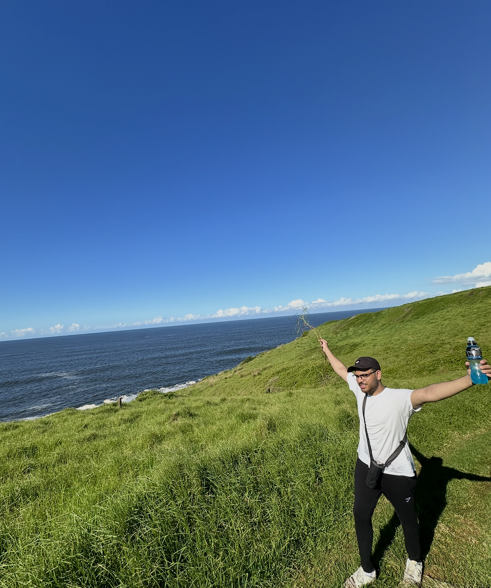

```{r setup, include=FALSE, echo=FALSE}
knitr::opts_chunk$set(echo = FALSE,
                      warning = FALSE, # suppressing warning messages
                      message = FALSE,
                      knitr.kable.max_rows = 6)

# attach any relevant packages
library(rmarkdown)
library(dplyr)
library(ggplot2)

# read the data files
courses <- read.csv(file = "courses.csv")
hobbies <- read.csv(file = "hobbies.csv")
```

# Anzar Alvi

## Bio {#bachelors-degree}

My name is Anzar! I am a 4th-year Computational Biology Specialist and Computer Science Major. I work with Dr. Phedias Diamandis and Dr. Kieran Campbell and am fascinated by the use of AI technologies for improving patient care. I intend to do a masters in Bioinformatics or a related field to continue pursuing my interests!

## Bachelors Degree

### Table of courses {#bachelors-degree-table}

**Table 1. Record of all undergraduate courses**

```{r courses_table, include=TRUE,echo=TRUE}
paged_table(courses)

```

### Plot of courses {#bachelors-degree-figure}

```{r courses_figure, include=TRUE,echo=TRUE, fig.cap = "**Anzar's Undergraduate Degree** Figure 1 summary of undergraduate courses barplot of the number of courses taken throughout the undergraduate degree. Colors represent the catagory of each course as part of the undergraduate course requirements."}
## organize the data for plotting
courses_counts <- courses %>%
  group_by(Course_Department, course_type) %>%
  count()

# plot 
ggplot(data=courses_counts, aes(x=Course_Department, y=n, fill=course_type)) +
  geom_bar(stat="identity", width=0.5) +
  labs(y="Number of Courses", x="Course Department", fill="Course Type") +
  theme_light() + 
  scale_y_continuous(limits = c(0, 12), breaks = seq(0, 12, by = 2))+
  ggtitle("Anzar's Undergraduate Degree")+
  theme(axis.text.y=element_text(size=12),
        axis.text.x=element_text(size=12))
  
```

## Hobbies

### Description {#my-hobbies}

I have many hobbies such as: playing guitar, reading, and going to the gym. I have outlined how many hours a week I spend on each hobby.

```{r hobbies_figure, include=TRUE,echo=TRUE, fig.cap = "**Anzar's Hobbies** Figure 2 barplot of the number of hours spent a week on each hobby."}
# plot
ggplot(data=hobbies, aes(x=hobby, y=hours_per_week)) +
  geom_bar(stat="identity", width=0.5) +
  labs(y="Hours per Week", x="Hobby") +
  theme_light() + 
  ggtitle("Anzar's Weekly Hobbies")+
  theme(axis.text.y=element_text(size=12),
        axis.text.x=element_text(size=12))
```

### Favorite Hobby {#favorite-hobby}

Currently, my favorite hobby is playing the guitar!

## Travelling! {#custom-section}

I'm always looking to travel and explore the world. I went to Australia recently for the first time. See a picture below!



## Questions to answer

1.[What is your bachelors degree?](#bachelors-degree)

2.[Which courses have you taken and in which departments?](#bachelors-degree-figure)

3.[What are your hobbies?](#my-hobbies)

4.[How many hours a week do you spend on each hobby?](#hobbies-hours-per-week)

5.[What is your favorite hobby?](#favorite-hobby)

6.[Add a custom section of your choosing!](#custom-section)

## Citations
